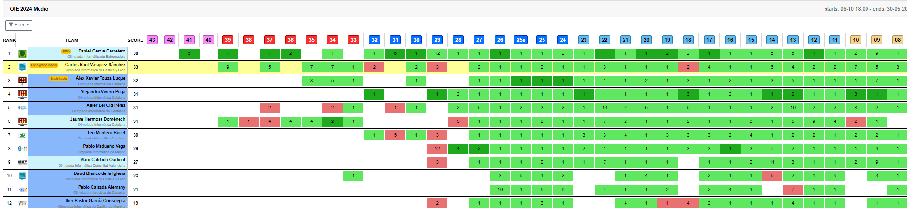
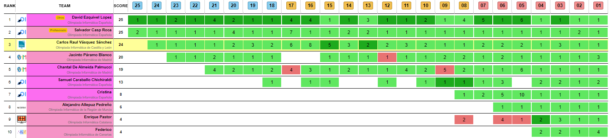

# olimpiadas-informaticas

Clases impartidas por la **Universidad Complutense de Madrid**. Este repositorio es utilizado para practicar en las Olimpiadas Informáticas curso 2023 y curso 2024, mejorando y aprendiendo en C++ y Java, si encuentras algún fallo o alguna mejora en el código, estaría encantado de recibir sugerencias mediante issues.

Sitio oficial de las Olimpiadas Informáticas:
https://olimpiada-informatica.org/

> [!NOTE]
> 📖 Todos los recursos de las clases se encuentran el directorio clases-nivel-medio, en ellas resumo lo dado en cada una de las clases. También algunos conceptos estan sacados de la web [Ayuda C++](https://aprende.olimpiada-informatica.org/index.php/algoritmia)

## Ejercicios

Las tareas propuestas en las clases son subididas a **"DOMjudge"**, un juez de codigo automático.
También hay otro juez que no es parte de las clases pero si de las olimpiadas llamado **"Acepto el reto"**
del que también intentare realizar ejercicios.

> [!IMPORTANT]
> Las puntuaciones varían con el tiempo en base a los ejercicios realizados, y la rapidez con la que se contesten.

## Final scoreboard 2023

> [!NOTE]
> 📖 Todos los ejercicios realizados en 2024 se realizarán en la medida de lo posible en Java. En este curso no hay apuntes debido a que se parece a lo realizado el año pasado, además de que este año están siendo más prácticos que teóricos.

## Actual scoreboard 2024

